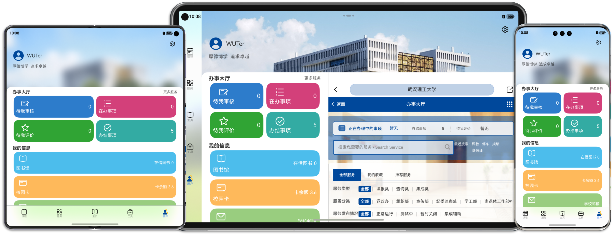

# 懂理

***
## 声明

本软件部分设计图片来源于武汉理工大学相关素材，其版权归武汉理工大学所有。图片仅用于提升用户体验及与实际校园环境的贴合性，未经许可不得擅自用于其他用途。

本软件部分功能需要通过武汉理工大学统一身份认证系统获取相关数据（如课程表、个人信息、电费余额等）。用户在使用本软件时，应遵守武汉理工大学的相关数据使用规定，不得擅自滥用、篡改或传播从统一身份认证系统中获取的数据。

本软件为第三方校园服务工具，以学习、分享为目的制作，与武汉理工大学无直接隶属或合作关系，所有用户数据存储在本地。任何由用户行为引发的数据安全或隐私问题，由用户自行承担。

***

## 简介

懂理是一款在HarmonyOS NEXT（5.0）系统下专为WUTer设计的**鸿蒙原生**校园助手软件，旨在为用户提供高效便捷的校园服务体验。无论是管理课程表、查询校园新闻，还是处理电费缴纳与校园网登录，都能一站式解决您的问题。

## 功能

### 课程表

支持直接从新教务系统直接导入课程表，并且可以对已经导入的课程表进行管理，操作类似于WakeUp课程表，方便快捷。

* **导入课程表**：支持查询当前学期的课程信息，包括课程时间、教室等。
* **编辑课程表**：自定义添加或修改课程，方便用户管理课余时间。
* **个性化设置**：支持个性化设定课程颜色，定制自己的课程表配色。
* **双视图浏览**：提供日程视图与列表视图，快速查看本周课程与全部课程。

### 校园服务

校园常用服务一键直达，个人信息快速浏览，将支持HarmonyOS应用接续功能，小屏大屏自由流转。

* **电费查询**：宿舍电费快速查询，可以设置常用宿舍，电费余额更快掌握。
* **校历查询**：校历直接显示在工具页面中，学期信息即见即得。
* **校园网登录**：校园网一键登录与注销，接入系统密保箱，自动保存、填充校园网密码。
* **校园服务**：服务页面列出常用校园应用，快速定位，一键直达。
* **个人信息**：登录智慧理工大后，便可以浏览办事大厅与个人有关信息。

### 校园资讯

登录智慧理工大后，即可浏览校园新闻，快速掌握最新校园资讯。

### 个人服务

登录智慧理工大后，便可获取办事大厅事务进度与个人信息。

## 页面

敏感信息已做处理，部分内容为虚构，如有雷同，纯属巧合！

### 主页

### 课程表

### 服务

### 工具

### 用户

## 特性

### 一次开发，多端部署

本应用支持HarmonyOS一次开发多端部署特性，支持手机、折叠屏与Pad三种设备使用，为不同设备提供适用于设备屏幕尺寸的布局与功能。

### 自由流转（开发中）

本应用将支持HarmonyOS的自由流转、应用接续能力，后续将支持组网设备数据同步。

### 动效

本应用使用HarmonyOS原生动画效果，包括出现/消失动画、一镜到底动画，丝滑流畅。

***

## 基本功能使用指南

### 登录智慧理工大

首次打开或者登录过期时，会出现登录页面，点击 **“登录”** 会将你引导到统一身份认证界面进行登录，如果不想进行登录可点击 **“跳过”** 直接进入主页，也可选择 **“始终跳过登录页”**，之后将不会弹出该界面，可以在应用设置中取消。

### 导入、管理课程表

首次进入或者登录过期时，进入页面右上角人形图标会提示“教务系统未登录”，点击该图标登录教务系统即可。登陆后，点击“＋” ->
“从教务导入”即可获取本学期的课程表，编辑学期第一天与课程表名称后点击“√”即可保存。

保存完成后，点击右上角最右侧图标，选择课程表即可展示。

当有课程表导入后，菜单中会显示已有的课程表

### 编辑课程

在日程视图点击课程卡片会弹出面板点击 **“编辑”** ，或者在列表视图长按课程卡片知道有振动反馈弹出菜单点击 **“编辑”**
都可以进入该课程的编辑页面，可以编辑课程名称、展示颜色、课程安排等信息，编辑完成后点击右上角 **“√”** 保存修改。

### 校园网认证

在工具页面的校园网组件中，依照提示输入你的校园网账号与密码，并确认手机仅通过WLAN连接到了校园网，点击登录即可完成认证。

### 电费查询

在工具页面的电费查询组件中，显示为“未登录”状态时，点击按钮，即可展开统一身份认证界面，完成登陆后，即可展开面板查询电费。

***

## 如何安装

1. 拥有华为开发者账号的条件下，使用DevEco Studio.
2. 详见[auto-installer](https://github.com/likuai2010/auto-installer/).

## 反馈与支持

当前软件仍处于开发测试阶段，稳定性较弱，可能存在崩溃、卡死、用户数据丢失等问题。如果您在使用过程中遇到问题，或者有改进建议，请通过以下方式联系我：

提交 Issue：[Issue](https://gitee.com/wuchengpei-sky/helper/issues)

发送邮件：w2563070231@outlook.com

***

## 开源许可

本项目代码以 **MIT License** 授权开源。您可以自由使用、修改和分发本软件，但需保留原始版权声明和许可证文件。

**保留原始版权声明和许可声明：**
您必须在软件的任何副本或主要部分中包含上述版权声明和本许可声明。

**免责申明：**
本软件按“现状”提供，无任何形式的明示或暗示保证，包括但不限于适销性、特定用途适用性及无侵权性。在任何情况下，作者或版权持有人不对因使用本软件而产生的任何索赔、损害或其他责任负责。

**素材限制：**
本软件包含的武汉理工大学设计图片仅用于非商业用途，用户需确保在分发和修改软件时不违反相关知识产权规定。

### 第三方代码声明

本项目使用了部分来源于 [HMOSWorld 鸿蒙世界](https://gitee.com/harmonyos_samples/hmosworld) 的代码，其授权协议为 [Apache License 2.0](https://www.apache.org/licenses/LICENSE-2.0)。  
根据 Apache License 要求，本项目保留了原始代码的版权声明及 NOTICE 文件，并在适当位置注明了修改内容。

***
## 开发与测试环境

* 应用开发在x86的Windows 11系统下进行。
* 所有功能在HUAWEI Mate 60 Pro(HarmonyOS NEXT 5.0.0.107, API13 beta3)下验证通过，其他设备功能均在模拟器验证通过。

## 参考项目

[1]. [HMOSWorld 鸿蒙世界](https://gitee.com/harmonyos_samples/hmosworld)

[2]. [WUTHelper 吾理小工具app](https://github.com/huanyuyh/wuthelperApp/tree/master)

